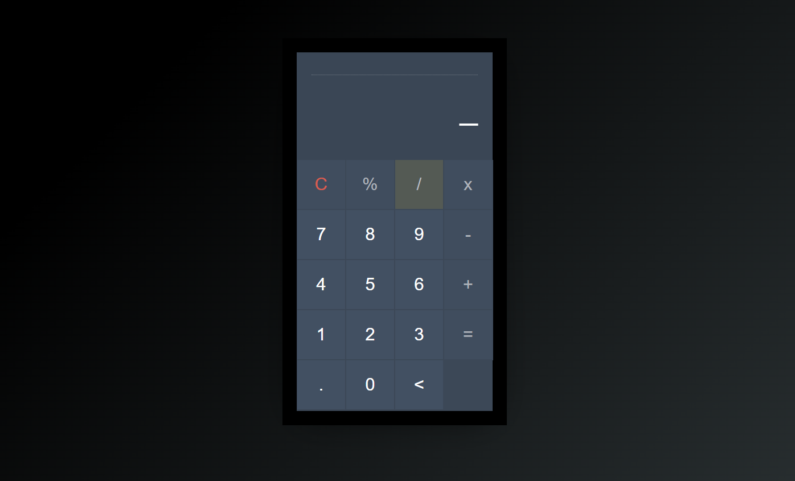
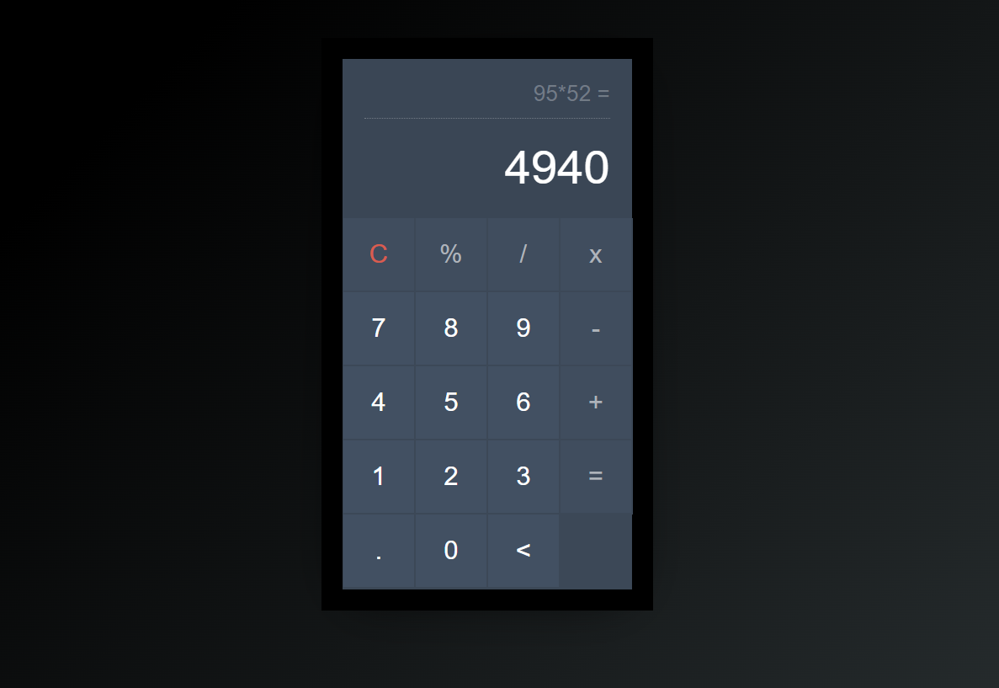

# Basic Calculator Project

## Introduction
The basic calculator project was designed to implement fundamental web development skills including HTML for structure, CSS for styling, and JavaScript for functionality. This task aimed to provide hands-on experience with creating an interactive web application.

## Features
- **Interactive Interface**: User-friendly design with clickable buttons for digits and operations.
- **Basic Operations**: Supports addition, subtraction, multiplication, and division.
- **Real-Time Calculation**: Displays input and results on the screen instantly.
- **Responsive Design**: Utilizes CSS Grid for flexible and responsive layout.

## Technologies Used
- **HTML**: Structure of the calculator.
- **CSS**: Styling and layout, including the use of CSS Grid for button alignment.
- **JavaScript**: Logic for handling user input and performing calculations.

## Installation
To run this project locally, follow these steps:

1. Clone the repository:
    ```bash
    git clone https://github.com/harisaigithub/codsoft-L1-T3-Calculator.git
    ```
2. Navigate to the project directory:
    ```bash
    cd codsoft-L1-T3-Calculator
    ```
3. Open `index.html` in your preferred web browser.

## Live Demo
Check out the live demo of the landing page [here]((https://codesoftl1t3.netlify.app/).
## Usage
1. Open the calculator in a web browser.
2. Use the buttons to input numbers and operations.
3. The result will be displayed on the screen after pressing the equals button.

## Project Structure
/codsoft-L1-T3-Calculator
│
├── index.html
├── styles.css
└── script.js

- **index.html**: The main HTML file containing the structure of the calculator.
- **styles.css**: The CSS file for styling the calculator.
- **script.js**: The JavaScript file that includes the logic for the calculator’s functionality.

## Development Process
1. **HTML Structure**: Created the basic structure with a display screen and buttons for numbers and operations.
2. **CSS Styling**: Applied styles to make the calculator visually appealing and used CSS Grid for button layout.
3. **JavaScript Functionality**: Added event listeners for button clicks, implemented the logic for arithmetic operations, and updated the display based on user input.

## Challenges Faced
- **Button Alignment**: Ensuring the buttons were evenly spaced and aligned correctly using CSS Grid.
- **Real-Time Display Updates**: Managing the real-time update of the display screen with user inputs and results.
- **Operation Logic**: Handling multiple sequential operations and ensuring accurate calculations.

## Conclusion
Completing this task was a significant learning experience, reinforcing my understanding of HTML, CSS, and JavaScript. The project challenged me to apply these skills in a practical scenario, resulting in a functional and interactive web application.
**Image File**: 


